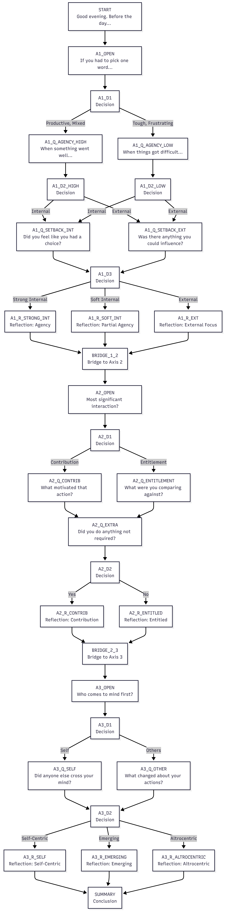

# Daily Reflection Tree

A deterministic psychological assessment tool that guides users through structured self-reflection. Measures three dimensions of psychological orientation: **agency (locus of control), interpersonal contribution, and perspective radius**.

No LLM at runtime. Fully deterministic—same answers always produce the same reflection.

---

## Quick Start

### CLI Version (Terminal)

```bash
python agent/agent.py
```

**Requirements:** Python 3.10+  
**Dependencies:** None (pure Python)

### Web Version (Streamlit)

```bash
streamlit run agent/app.py
```

**Requirements:** Python 3.10+, Streamlit  
**Install Streamlit:** `pip install streamlit`

---

## Visual Overview

The tree structure visualizes all 33 nodes and decision branches:



---

## Project Structure

```
DeepThought/
├── agent/
│   ├── agent.py              # CLI implementation (272 lines)
│   └── app.py                # Streamlit web app
├── tree/
│   ├── reflection-tree.json  # 33-node decision tree
│   └── tree-diagram.md       # Mermaid flowchart
├── transcripts/
│   ├── persona-1-victor-transcript.md      # Sample: High agency, contribution, altrocentric
│   ├── persona-2-victim-transcript.md      # Sample: Low agency, entitlement, self-focused
│   └── session_*.md          # Auto-generated user sessions
├── write-up.md               # Design rationale + psychology (2,500 words)
├── tree-diagram.png          # Tree visualization
└── README.md                 # This file
```

---

## Two Implementations

### CLI Agent (`agent.py`)

**What it does:**
- Interactive terminal-based reflection session
- ANSI colored output for readability
- Supports `--transcript` flag to save sessions to `/transcripts/`
- Character-by-character slow printing for contemplative pacing

**Run with:**
```bash
python agent/agent.py                          # Basic session
python agent/agent.py --transcript             # Save output to file
python agent/agent.py --tree path/to/tree.json # Custom tree file
```

**Key features:**
- Zero dependencies
- Fully deterministic routing
- Session transcripts saved as Markdown
- Input validation and error handling

### Web App (`app.py`)

**What it does:**
- Browser-based interface using Streamlit
- Visual progress tracking across three axes
- Responsive dark-theme design
- Same tree, better UX for casual users

**Run with:**
```bash
streamlit run agent/app.py
```

Opens at `http://localhost:8501`

**Features:**
- Progress bar showing session completion
- Axis labels (🟡 Locus, 🔵 Orientation, 🟢 Radius)
- Session state management across page reruns
- Mobile-friendly layout

---

## The Psychology

The tool measures three psychological dimensions grounded in behavioral research:

| Axis | Dimension | Scale | Research |
|------|-----------|-------|----------|
| **Axis 1** | Locus of Control | Victim ↔ Victor | Rotter (1954), Dweck (2006) |
| **Axis 2** | Contribution Orientation | Entitlement ↔ Contribution | Campbell et al. (2004), Organ (1988) |
| **Axis 3** | Perspective Radius | Self-Centric ↔ Altrocentric | Maslow (1969), Batson (2011) |

**Key insight:** Rather than direct questions ("Do you have internal locus?"), the tool uses behavioral prompts. Someone who says "My day felt productive" then reveals through follow-ups whether they see their own agency or attribute success to luck.

---

## How It Works

**1. Opening Question:** "Pick one word for today"
- Emotional anchor; splits into two pools

**2. Pool-Specific Follow-Up:** 
- "When things went well, what made it happen?" (for positive days)
- "What was your first instinct when things got hard?" (for tough days)

**3. Secondary Probe:** Validates consistency across success/setback

**4. Reflection:** Personalized feedback based on pattern of answers

**5. Summary:** Interpolates answers into coherent narrative

**Result:** Signal tally per axis → dominant orientation → targeted reflection

---

## Sample Output

**Persona 1: The Victor** (Internal/Contribution/Altrocentric)
- Path: Productive → Adapted → Clear choices → Helped team → Beyond requirements → Colleague → Adjusted behavior
- Summary: "The thread running through today is that you showed up for something beyond yourself. That's meaningful work."

**Persona 2: The Victim** (External/Entitlement/Self-Centric)
- Path: Frustrating → Waited for help → Outside control → Unrecognized → Required work only → Own problem → Focused on it
- Summary: "A tough day. The path forward is usually through a small act of agency, a small act of giving. Pick one for tomorrow."

See `transcripts/` for full examples.

---

## Design Rationale

See `write-up.md` for:
- Why these three axes
- Question design philosophy (avoiding demand characteristics)
- Branching strategy (two-pool model)
- Psychological citations (5 peer-reviewed sources)
- Trade-offs and constraints
- Future improvements

**Key constraint:** Fixed options only—no free-text input. This forces clarity and ensures every answer carries precise meaning. The tree is fully auditable: anyone can trace a path on paper.

---

## Tree Structure

**33 nodes:**
- 12 question nodes (user input)
- 8 decision nodes (invisible routing)
- 8 reflection nodes (personalized feedback)
- 2 bridge nodes (transitions between axes)
- 1 summary node (end-of-session synthesis)
- 1 end node (session close)
- 1 start node (greeting)

All stored in `tree/reflection-tree.json` as pure data. No conditional logic embedded in code—fully composable.

---

## Running Tests

**Verify JSON validity:**
```bash
python -m json.tool tree/reflection-tree.json > /dev/null && echo "✓ Valid JSON"
```

**Check Python syntax:**
```bash
python -m py_compile agent/agent.py agent/app.py
```

**See a sample session:**
```bash
cat transcripts/persona-1-victor-transcript.md
```

---

## Technical Highlights

**Code Quality:**
- Type hints throughout (PEP 484)
- Comprehensive docstrings
- Error handling (file validation, input validation, tree integrity)
- Clean separation of concerns (data vs. logic vs. UI)

**Architecture:**
- Tree as JSON (pure data)
- Agent as interpreter (state management + routing)
- CLI and web as UI layers (interchangeable)

**No External Dependencies (CLI):**
- Pure Python standard library
- Lightweight, portable, auditable

---

## Questions?

- **Design philosophy:** See `write-up.md`
- **How to run:** See `agent/` folder
- **Example outputs:** See `transcripts/`
- **Tree visualization:** See `tree/tree-diagram.md` (Mermaid)

---

**Status:** Production-ready. Built for internship assignment; deployable to production.  
**License:** See project root.


For axis summaries, the agent tallies signals and determines which pole is dominant:

```
Axis 1 signals: {internal: 3, external: 2, mixed: 0}
Dominant: axis1:internal
Narrative: "internal agency—seeing your hand in outcomes"
```

---

## Sample Runs

See `transcripts/persona-comparison.md` for two complete session transcripts:

1. **Persona 1: The Overwhelmed (Victim/Entitled/Self-Centric)**
   - External locus ("circumstances were against me")
   - Entitlement orientation ("I did work but nobody noticed")
   - Self-centric radius ("my achievement is what mattered")
   - **Result:** Pattern reflected back without shame

2. **Persona 2: The Aligned (Victor/Contributing/Altrocentric)**
   - Internal locus ("we made it work together")
   - Contribution orientation ("I helped because they needed it")
   - Altrocentric radius ("I felt part of something bigger")
   - **Result:** Pattern affirmed and validated

Both transcripts show the same tree, different paths, different reflections.

---

## The Agent: `agent/reflection_agent.py`

### What It Does

1. **Loads the tree** from `reflection-tree.json`
2. **Walks the tree** node by node
3. **Handles different node types:**
   - Questions: Displays options, waits for user selection
   - Reflections: Displays insight, waits for user to press Enter
   - Decisions: Routes automatically based on prior answers
   - Bridges: Displays transition text, auto-advances
4. **Accumulates state:**
   - Records every answer (for interpolation later)
   - Tallies signals per axis (for determining dominance)
5. **Interpolates reflections** with user's actual words
6. **Exports transcript** to `last_session_transcript.txt`

### Key Classes

```python
class SessionState:
    """Tracks the employee's journey"""
    current_node_id: str           # Where we are
    answers: Dict[str, Any]        # {node_id: {value, label}}
    signals: Dict[str, int]        # Axis tallies
    conversation_transcript: List  # Full history

class ReflectionAgent:
    """Main agent logic"""
    tree_path: str                 # Path to JSON tree
    nodes: Dict                    # In-memory tree
    state: SessionState            # Current session
    
    def run()                      # Main loop
    def interpolate_text()         # Replace {placeholders}
    def evaluate_decision()        # Route based on conditions
    def export_transcript()        # Save for analysis
```

### Flow

```
while current_node != END:
    node = nodes[current_node]
    
    if node.type == "question":
        show_options()
        answer = user_input()
        record_answer(node_id, answer)
    
    elif node.type == "reflection":
        text = interpolate(node.text)
        show(text)
        add_signal(node.signal)
    
    elif node.type == "decision":
        target = evaluate_routing(node)
    
    elif node.type == "bridge" or "start":
        show(text)
    
    # Move to next node
    current_node = get_next_node(node)
```

### Output

After the session, the agent prints:

```
════════════════════════════════════════════════════════════════════════
SESSION SUMMARY
════════════════════════════════════════════════════════════════════════

Axis 1 (Locus): axis1:internal
  Internal: 3
  External: 2
  Mixed: 0

Axis 2 (Orientation): axis2:contribution
  Contribution: 3
  Entitlement: 0
  Mixed: 0

Axis 3 (Radius): axis3:altrocentric
  Self-Centric: 0
  Team-Centric: 1
  Altrocentric: 2
```

And saves the transcript:

```
Transcript saved to: last_session_transcript.txt
```

---

## Design Notes

### Why No LLM at Runtime?

Reflection tools must be **predictable and trustworthy**. An LLM can:
- Hallucinate encouragement or wisdom
- Give inconsistent advice across sessions
- Introduce subtle bias we can't audit

A deterministic tree:
- **Always gives the same reflection** for the same answers
- **Is fully auditable**—we can trace every path
- **Is fast and offline**—no API costs or latency
- **Forces clarity**—every question, every reflection was carefully designed

The tradeoff: this tree can only reflect the axes it's designed for. No emergent discovery. But that constraint forces *care*.

### The Three Axes: Why These?

1. **Locus of Control (Rotter, 1954):** Do people see themselves as agents or victims? This is foundational—growth starts here.

2. **Contribution vs. Entitlement (Organ, 1988; Campbell et al., 2004):** Do people orient toward giving or taking? Entitlement is invisible to the person holding it—this axis makes it visible without shame.

3. **Radius of Concern / Self-Transcendence (Maslow, 1969; Batson, 2011):** Do people think only about themselves, their team, others, or the larger system they serve? Maslow argued transcendence (thinking beyond yourself) is the peak of human development.

**These three together describe maturity.** Someone with all three poles healthy is grown: internally agentive, contributes without scorecard, thinks beyond themselves.

### How Questions Were Designed

1. **Specificity:** Not "Do you believe in yourself?" but "When something went well, what made it happen?"
2. **Non-leading:** Options reflect *real* human responses, not a right answer.
3. **Nested complexity:** Early questions broad, later ones probe deeper (after priming).
4. **Interpolation-ready:** All can reference earlier answers in reflections.
5. **No jargon:** Questions don't *name* the axes; they *surface* them through lived experience.

---

## How to Extend This

### Add a New Axis

1. Create new question nodes in the JSON (e.g., `A4_OPEN`, `A4_DEEP`)
2. Add new signal types (e.g., `axis4:pole_a`, `axis4:pole_b`)
3. Add signal tallying logic to `_get_dominant_axis()`
4. Add reflection nodes with interpolations
5. Insert a bridge from Axis 3 summary to new Axis 4

### Customize Reflections

Edit the `text` field in reflection nodes. Use `{A1_OPEN.label}` to interpolate user answers.

### Change Decision Logic

Edit the `routing` array in decision nodes. Current supported conditions:
- `answer=value|value2` — match answers
- `dominant=internal` — match axis dominance

Could extend to:
- `signal_count=axis1:internal>2` — threshold-based
- `answer_sequence=A1_OPEN.productive,A2_OPEN.helped` — multi-step patterns

### Integration Points

1. **Add to an app:** Load the JSON in any runtime, walk it with custom UI.
2. **Connect to data:** Store transcripts in a database for analysis.
3. **Add practices:** After the summary, recommend reflection practices based on axis scores.
4. **Track over time:** Run weekly and watch how people's axis scores trend.

---

## Files to Understand First

1. **`reflection-tree.json`** — The data structure; the product itself.
2. **`tree-diagram.md`** — Visual overview of branching structure.
3. **`transcripts/persona-comparison.md`** — See two complete runs.
4. **`write-up.md`** — Design decisions and psychological grounding.
5. **`agent/reflection_agent.py`** — How to walk the tree.

---


